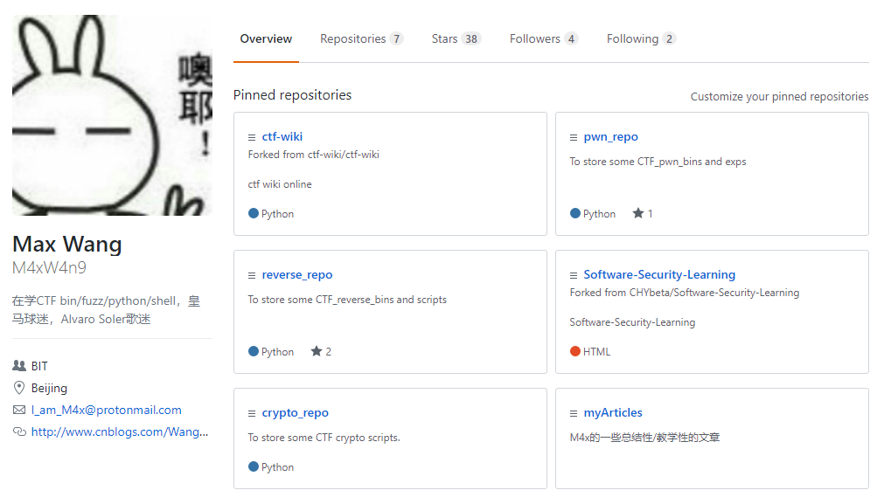

# git简明教程（Ⅰ）

> By M4x@10.0.0.55

> 先阐明git与github的关系：
>
> - git是一个分布式版本管理工具，总之是一个软件
> - github是一个代码托管平台，总之是一个网站
> - github这个网站使用git这个版本管理工具来托管代码
>
> 举个形象的例子，git是弓，github是靶，源代码就是箭
>
> 可以看出，git也可以用于其他以git为托管工具的平台，如国内比较流行的[coding](https://coding.net/)

## git安装

#### linux && mac平台：

*nix平台的git安装较为简单，直接使用对应的包管理命令直接安装即可

```bash
# Debian & Ubuntu
$sudo apt-get install git
# CentOS
$sudo yum instal git
# mac
$sudo brew install git
```

####Windows平台

在windows上使用git就稍微麻烦一点了

- 首先从git官网下载[安装程序](https://git-scm.com/download/win)，建议安装64位安装版

  

- 运行安装程序，选择合适的安装路径

- next到配置选项，建议勾选Windows Explorer integration，其余选项根据自己喜好选择

  

- 在开始菜单创建选项，根据自己喜好选择

  

- 接下来选择默认git环境中的默认编辑器，有Nano，vim，np++，VScode四种可选(虽然git安装程序不建议使用vim，但一名合格的程序员还是应该了解一些vim的基本用法的，因此这里以安装vim做演示)

  

- 接下来选择环境变量

  

  > 解释一下：
  >
  > - Use Git from Git Bash only：只在打开git bash的时候才能在终端里使用git，推荐新手选择此项
  > - Use Git from the Windows Command Prompt：在windows的命令提示符（即常见的windows cmd）下即可使用git，对windows的环境变量破坏较小，推荐轻度linux用户选择此项
  > - Use Git and optional Unix tools from the Windows Command Prompt：除了git，其他一些Unix命令也会被安装到windows环境里并且可以在windows cmd中使用，推荐Linux重度用户选择

- 选择https的加密协议，两种协议，建议选择OpenSSL

  

- 选择换行风格([不同系统换行的区别](http://www.ruanyifeng.com/blog/2006/04/post_213.html))，为了减少不同平台下开发者之间的换行歧义，windows建议选择第一项

  

- 选择git bash的风格，建议选择第一项MinTTY

  

- 其他选项，如无特殊要求，默认即可

  

- 点击Install即可安装，安装成功后可以在鼠标的右键菜单里看到Git GUI Here和Git Bash Here两个选项（如果在配置中勾选了该选项）

  

- 打开git gui进行测试

   


#### 配置git

无论在哪种平台，第一次使用时首先要对用户名和邮箱进行配置，这里以github为例，先申请一个[github账户](https://github.com/join)

在git bash中运行（bash中tab具有命令补全的功能）

```
git config --global user.name "Your name"
git config --global user.email "Your email"
```

这两句命令是为了让远程仓库知道提交来自哪台机器，**--config**参数表示这台机器上的所有Git仓库都使用这个配置。


至此，git的安装和初步配置就已经完成了

## 和git有关的基本概念

- 版本库：版本库又名仓库，英文**repository**，在这个仓库里的所有变化，包括文件的增加，修改和删除都会被git跟踪记录，这样在将来的某个时刻就可以还原仓库

- 远程仓库：顾名思义，远程仓库就是托管在远程服务器的仓库；在远程服务器而不是保管在本地的最大好处就是多人可以协同工作，并且很少担心仓库挂掉。对远程仓库最直观的印象就是在github等平台看到的仓库：

  

  > 每人都从远程仓库克隆一份到自己电脑，然后把各自的提交推送到远程服务器仓库，同时也可以从服务器仓库拉取别人的提交

- 分支：可以类比火影忍者中影分身的概念，每一个分支是一个分身，每个分身的所作所为（代码的提交或者删除）对其他的分身并不会有影响，但当分身解除（工作完成，分支融合），主体又会获得所有分身的状态（最终的仓库融合所有人的代码）。**默认分支为master**

  

- 工作流：git维护了三棵树

  - 工作目录：就是本地工作的文件夹，**拥有实际文件**

  - 缓存区（Index）：临时保存改动

  - HEAD：指向最后一次提交的结果

    

    

