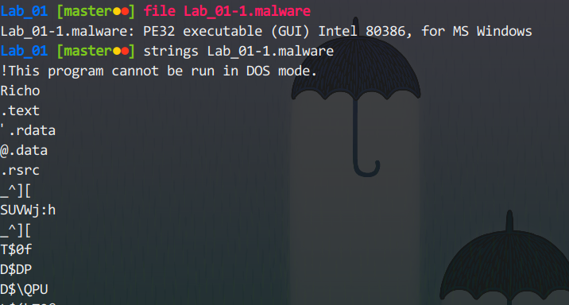
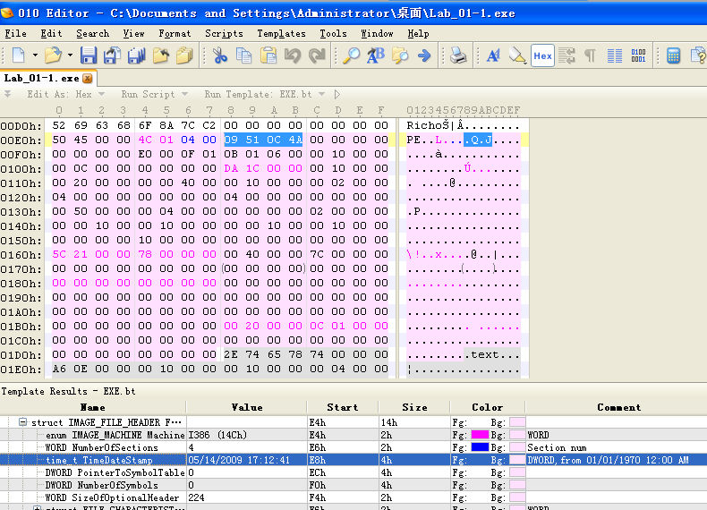
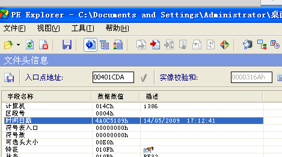
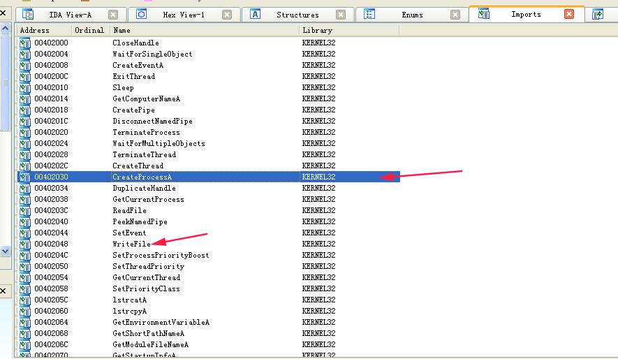
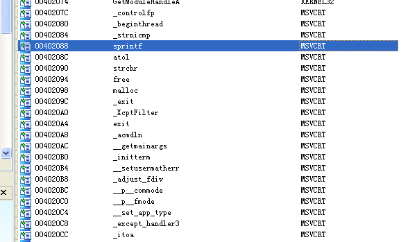
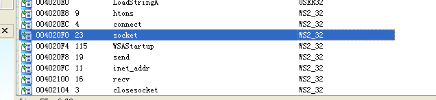
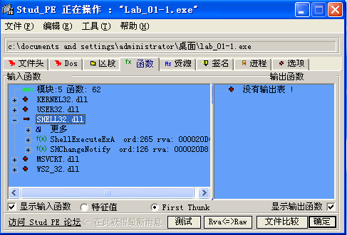
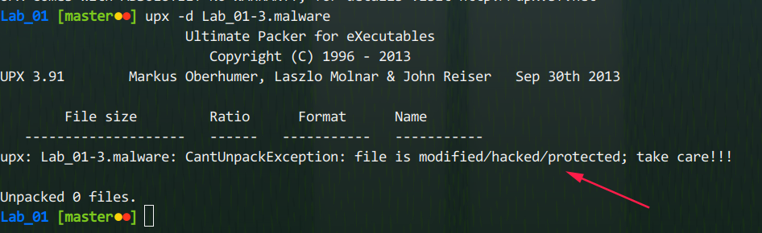

# Lab 01 ­ Basic Analysis

## Lab_01­1.malware

### 分析：

首先查看文件类型，为windows下的32位GUI可执行文件，并用strings命令列出文件中的可打印字符串

1. **(1 pts) When was this file compiled?**

   1. 通过分析PE文件格式，得到该文件的时间戳为**4A0C5109H**，该值为从1970年1月1日0:00以来的总秒数，则即为***05/14/2009 17:12:41***(下图为使用了exe template的**010 editor**的截图)

      

   2. 用**PE Explorer**打开该文件，在文件头中发现时间戳***14/05/2009 17:12:42***

   

2. **(6 pts) List a few imports or sets of imports and describe how the malware might use them.**

  1. 使用**IDA6.8**打开该文件，在Imports窗口看到该程序导入了**kernel32.dll，msvcrt.dll，user32.dll，shell32.dll，ws2\_32.dll**等动态链接库

     a. kernel32.dll主要引入了一些处理线程，文件相关的函数

     

     b. msvcrt.dll引入了一些和堆与字符串相关的函数

     

     c. ws2\_32.dll，很明显，和网络通信相关

     

  2. 用另一个工具**Stud_PE**也能得出相同结论，不在复述

     

     ​

3. **(6 pts) What are a few strings that stick out to you and why?**
  **a.**
  **b.**
  **c.**

4. **(2 pts) What happens when you run this malware? Is it what you expected and why?**

5. **(2 pts) Name a procmon filter and why you used it.**

6. **(4 pts) Are there any host­based signatures? (Files, registry keys, processes or services, etc).**
  **If so, what are they?**

7. **(4 pts) Are there any network based signatures? (URLs, packet contents. etc) If so, what are**
  **they?**

8. **(1 pts) Is there anything that impeded your analysis? How so? How might you overcome this?**

9. **(2 pts) What do you think is the purpose of this malware?**
## Lab_01­2.malware
1. **(1 pts) What is the md5sum? What of interest does VirusTotal Report?**

2. **(6 pts) List a few imports or sets of imports and describe how the malware might use them.**

   **a.**
   **b.**
   **c.**

3. **(6 pts) What are a few strings that stick out to you and why?**
  **a.**
  **b.**
  **c.**
4. **(2 pts) What happens when you run this malware? Is it what you expected and why?**
5. **(2 pts) Name a procmon filter and why you used it.**
6. **(4 pts) Are there any host­based signatures? (Files, registry keys, processes or services, etc).**
  **If so, what are they?**
7. **(4 pts) Are there any network based signatures? (URLs, packet contents. etc) If so, what are**
  **they?**
8. **(1 pts) Is there anything that impeded your analysis? How so? How might you overcome this?**
9. **(2 pts) What do you think is the purpose of this malware?**

## Lab_01­3.malware
1. **(3 pts) Are there any indications that this malware is packed? What are they? What is it**

**packed with?**

2. **(1 pts) Are you able to unpack it? Why or why not?**

   如下图，常规的方法并不能脱壳，并且已经提示了原因：**file is modified/hacked/protected**

3. **(3 pts) What are a few strings that stick out to you and why?**

   **a.**
   **b.**
   **c.**

4. **(2 pts) What happens when you run this malware? Is it what you expected and why?**

5. **(2 pts) Are there any host­based signatures? (Files, registry keys, processes or services, etc).**
  **If so, what are they?**

6. **(4 pts) Are there any network based signatures? (URLs, packet contents. etc) If so, what are**
  **they?**

7. **(3 pts) Is there anything that impeded your analysis? How so? How might you overcome this?**

8. **(2 pts) What do you think is the purp**