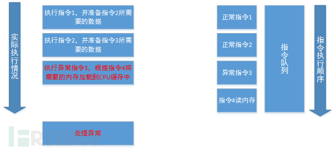
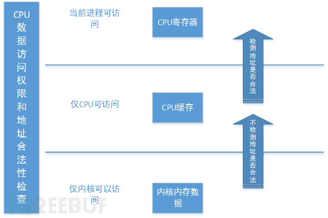
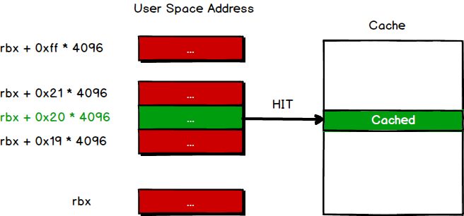
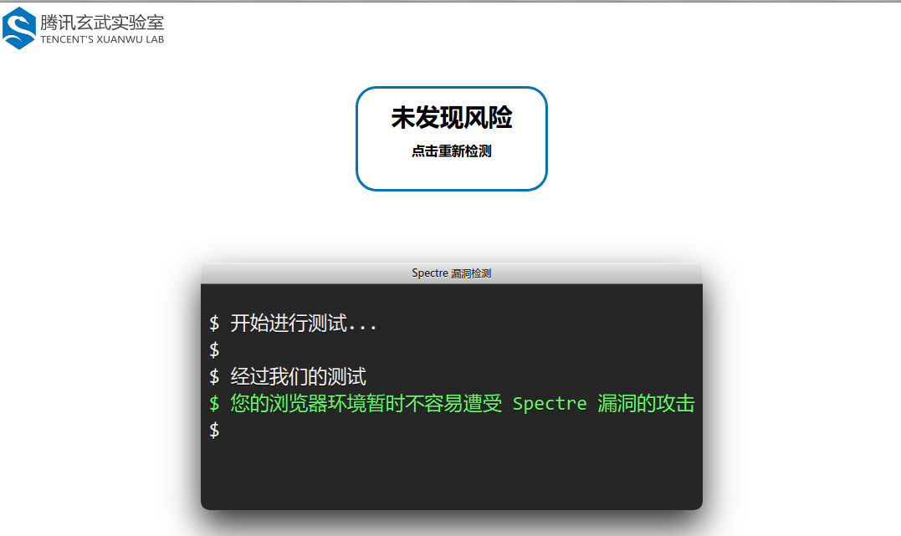

## meltdown & spectre

- Meltdown: 几乎所有Intel CPU和部分ARM CPU
- Spectre: 所有Intel CPU和AMD CPU以及主流ARM CPU

## 原理

###乱序执行(Out-of-Order Execution)和预测执行(Speculative Execution)

- CPU遇到指令依赖的情况时，会转向下条不依赖的指令去执行

  > - 乱序执行中，指令并没有真正执行而只是加载到缓存中是不会执行安全检查的；
  > - 由于乱序执行而被提前执行的指令会被处理器丢弃，但缓存的状态不会被重置

- 当包含CPU处理分支指令时，根据判定条件的真/假，会产生跳转。此时CPU不会等待判定结果而会预测出某一条件分支执行

  > - 预测正确，性能提升
  > - 预测错误，CPU状态恢复，但缓存状态保留





### 侧信道攻击

- Flush + Reload

  > 攻击者可以反复利用处理器指令将监控的内存块（某些地址）从缓存中驱逐出去，然后在等待目标程序访问共享内存（Flush阶段）。然后攻击者重新加载监控的内存块并测量读取时间(Reload阶段)，如果该内存块被目标程序访问过，其对应的内存会被导入到处理器缓存中，则攻击者对该内存的访问时间将会较短。通过测量加载时间的长短，攻击者可以清楚地知道该内存块是否被目标程序读取过。

  ​

## payload

meltdown：允许在用户态无限制的读取内核态的数据

```assembly
; rcx = kernel space address
; rbx = probe_array

mov al, byte [rcx] 
shl al, 0xc
mov rbx, qword [rbx + rax]
```




## 检测

https://xlab.tencent.com/special/spectre/spectre_check.html




