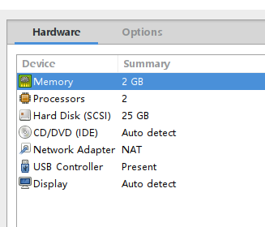
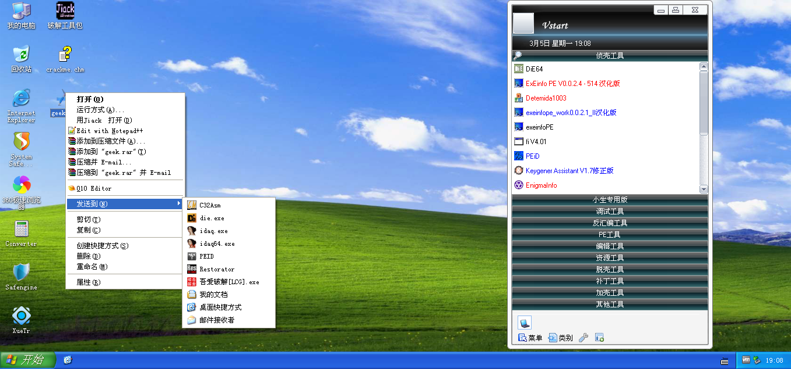
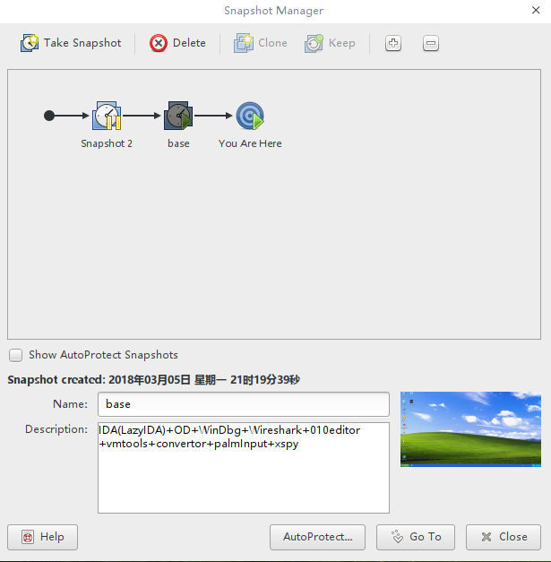
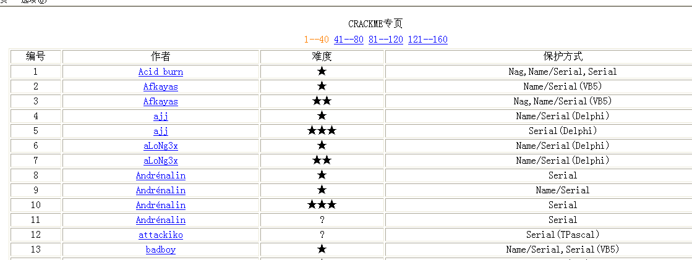

# virus虚拟机使用说明

> 该虚拟机是在吾爱破解七周年虚拟机的基础上配置的，添加了VMware tools，IDA（lazyIDA，bracket插件），WinDbg，python2.7，010 editor，convertor，xspy，手心输入法等工具。

## 使用方法

- [下载虚拟机](10.4.21.199/~virus/tools)

- 安装vmware（网上有很多教程，不再介绍）

- 打开***Windows XP By 52PoJie.vmx***即可，开箱即用

- 默认配置为2G内存，2核，可根据自己需要更改

  

  ​

## 常用工具

- 已经把IDA，Ollydbg(右键发送菜单里的*吾爱破解[LCG].exe*)，010 editor，peid等工具集成到右键菜单里

- 更多工具请看**破解工具包**

  

- 所有工具都安装在了D盘里

- 部分分析PE的工具(procmon, process explorer, RegShot)在破解工具箱的**PE工具**一栏

- wireshark, apatedns在破解工具箱的**其他工具**一栏

- WinDbg在破解工具箱的**调试工具**一栏

## More

- 已创建两个快照，可根据需要恢复虚拟机

  

- 桌面上有一个crackme的集合**crackme.chm**，有兴趣的同学可以尝试一下

  

  ​

- 吾爱破解已经发布[破解虚拟机v2.0](https://www.52pojie.cn/thread-661779-1-1.html)，有更多强大的工具，但较难安装VMware tools，有兴趣的同学可以自行下载体验
- 原虚拟机作者[52Pojie](https://www.52pojie.cn/thread-341238-1-1.html)
- 二次开发 By [M4x@10.0.0.55](http://www.cnblogs.com/WangAoBo/)，欢迎[follow和star](https://github.com/M4xW4n9)

